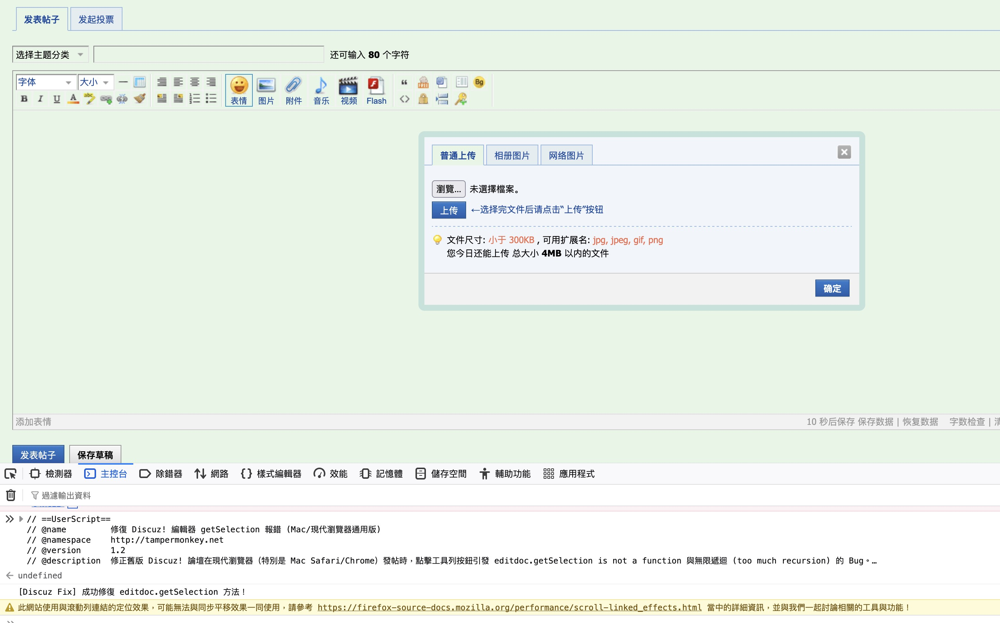

# 🛠️ Discuz! 編輯器 getSelection 報錯修復腳本

這個輕量級的 Tampermonkey（油猴）腳本專門為了解決**舊版 Discuz! 論壇系統（如 X3.4 等版本）**在現代瀏覽器（（特別是 Mac Safari/Firefox/Chrome）中發帖時的相容性錯誤。

---

## 🛑 解決痛點

當你在論壇發帖頁面點擊工具列按鈕（如**加粗**、**插入代碼塊**、**調整字體顏色**或**表情**）時，網頁無回應，且開發者工具（Console）中跳出以下錯誤：

* `Uncaught TypeError: editdoc.getSelection is not a function`
* `Uncaught InternalError: too much recursion` (無限死循環)
* `Uncaught ReferenceError: oc_tx is not defined`

由於 Mac 系統無法開啟 Windows 特有的 **IE 相容模式**，此腳本透過劫持並快照瀏覽器最底層的「原生 Selection 函數」，在不破壞原網頁結構的前提下，完美繞過無限遞迴，恢復編輯器的所有按鈕功能！



---

## ✨ 主要功能

* **原生函數接管**：自動將 `editdoc.getSelection` 重導向至乾淨的瀏覽器原生選區函數。
* **防死循環機制**：內建防止 `editwin` 與 `editdoc` 相互繼承導致的 `too much recursion` 遞迴崩潰。
* **連帶錯誤修復**：自動補全未定義的全局變數（如 `oc_tx`），確保編輯器底層邏輯流暢執行。
* **高效能設計**：採用動態定時器監聽，成功掛載後 5 秒內自動銷毀，不佔用任何背景瀏覽器資源。

---

## 🚀 安裝與使用說明

1. 確保您的瀏覽器已安裝 [Tampermonkey 擴充功能](https://tampermonkey.net)。
2. 點擊 GreasyFork 上的 **「安裝此腳本」** 按鈕。
3. 重新整理出問題的 Discuz! 論壇發帖網頁，即可正常使用工具列！

### 🌐 擴大支援其他論壇

目前腳本預設支援 **HIFIDIY 論壇** (`bbs.hifidiy.net`)。如果您在其他 Discuz! 論壇也遇到相同錯誤，請依以下步驟手動新增網址：

1. 點擊瀏覽器右上角的 Tampermonkey 圖示 ➡️ 選擇 **「控制台」**。
2. 找到本腳本並點擊 **「編輯」**。
3. 在腳本頂部的註釋區（Metadata Block），手動新增一行目標論壇網址：
   ```javascript
   // @match        *://*.其他論壇網址.com/*
   ```
4. 按下 `Ctrl + S` (Windows) 或 `Cmd + S` (Mac) 儲存即可！

---

## 📜 授權條款

本專案採用 [GNU GPLv3](https://gnu.org) 授權條款開源。您可以自由複製、修改及分發本腳本，但任何基於本專案的衍生作品均須以 GPLv3 條款開源並保留作者聲明。
